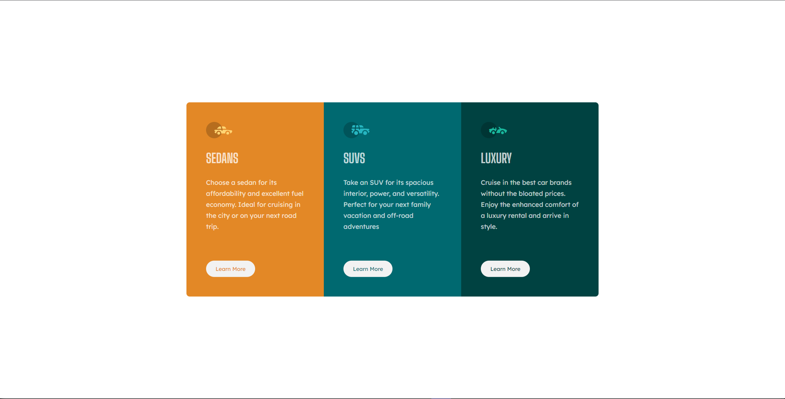

# Frontend Mentor - 3-column preview card component solution

This is a solution to the [3-column preview card component challenge on Frontend Mentor](https://www.frontendmentor.io/challenges/3column-preview-card-component-pH92eAR2-). Frontend Mentor challenges help you improve your coding skills by building realistic projects.

## The challenge

Users should be able to:

- View the optimal layout depending on their device's screen size
- See hover states for interactive elements

## Screenshot

## Links

- Solution URL: (<https://github.com/Crisscoder/Card_Component>)
- Live Site URL: (<https://crisscoder.github.io/Card_Component/>)

## Resources
- Youtube: 5 Formas de Centrar con CSS https://www.youtube.com/watch?v=Hd3Z_i3vq0w&t=549s

## Built with

- Semantic HTML5 markup
- CSS custom properties
- Position
- Flexbox
- Mobile-first workflow
